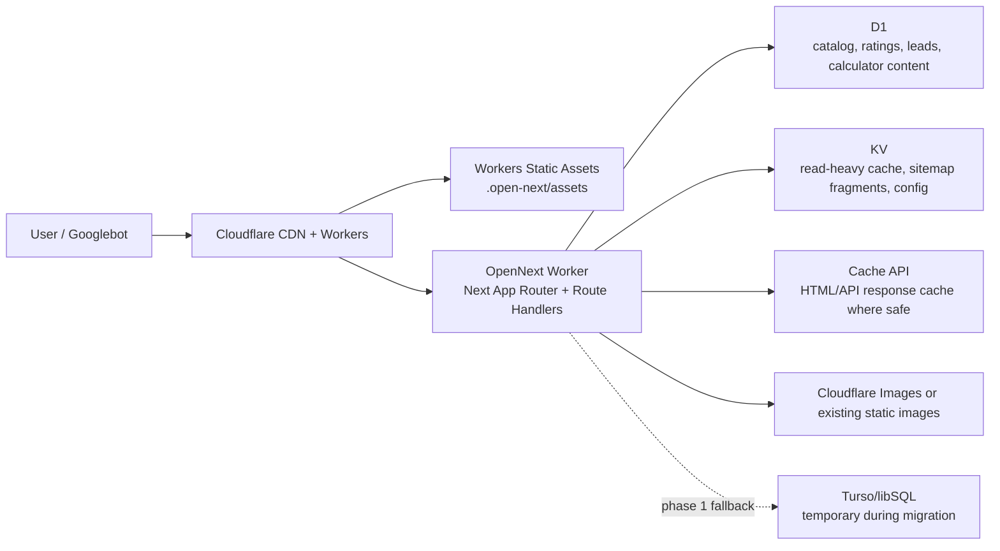

# Cloudflare Workers + D1 + KV Migration Assessment

Date: 2026-05-08

Repository: `smartlock-next`

Target platform: Cloudflare Workers with OpenNext, D1, KV, Workers Static Assets, and optional Cloudflare Images/R2 later.

## Executive Summary

Recommendation: migrate, but do it in phases.

This site is a good candidate for Cloudflare Workers because it is mostly read-heavy, SEO-heavy, and statically generated. The latest production build generates `1543` static pages, public assets are small, and the app already uses SQLite-compatible SQL. The main value of Cloudflare is global static delivery, lower edge latency, Workers-native API routes, and simplified Cloudflare DNS/CDN/security ownership.

Do not attempt a one-shot "Turso to D1 plus Vercel to Workers" switch. After B2/B3/B4 adapter and runtime work, the remaining platform assumptions are:

- `app/api/auth/login/route.ts` and `app/status/page.tsx` now run under Workerd/OpenNext with no explicit `runtime = 'nodejs'`.
- Core data access imports `@/lib/db`, which is now the single canonical facade with D1 binding preference and Turso fallback.
- The stale second adapter `lib/db/client.ts` has been removed to avoid divergent DB paths.
- Lead capture now writes through the canonical facade rather than checking Turso-specific env vars.
- Admin auth uses `bcryptjs`; it may run in Workers with `nodejs_compat`, but bcrypt cost can be CPU-heavy and should be tested under Workers limits.

Best migration path:

1. Deploy the existing Next.js app to Workers through OpenNext while still using Turso.
2. Refactor data access into a real runtime adapter that can use Cloudflare bindings.
3. Migrate catalog, rating, calculator, and lead data to D1.
4. Add KV only for read-heavy cache/config, not transactional data.
5. Cut traffic after `wrangler dev` / preview / production smoke tests pass.

## Official Platform Facts Used

Cloudflare's current Next.js guide says Next.js apps can be deployed to Workers using the OpenNext adapter. App Router, Route Handlers, React Server Components, SSG, SSR, ISR, Server Actions, response streaming, middleware, and image optimization via Cloudflare Images are listed as supported. The docs also note that existing projects can be deployed with `wrangler deploy`, which can auto-detect Next.js and generate OpenNext configuration including `.open-next/worker.js`, `.open-next/assets`, `nodejs_compat`, and observability.

Workers limits to plan around:

- Workers Free: 100,000 requests/day, 10 ms CPU/request, 128 MB memory, 50 subrequests/request, 3 MB compressed Worker size.
- Workers Paid: no daily request limit, default 30 seconds CPU/request configurable up to 5 minutes, 128 MB memory, 10,000 subrequests/request, 10 MB compressed Worker size.
- Static assets per Worker version: 20,000 on Free, 100,000 on Paid. This repo is currently far below that.

D1 limits to plan around:

- D1 Free: 10 databases, 500 MB max database size, 5 GB storage/account.
- D1 Paid: 50,000 databases/account, 10 GB max database size, 1 TB storage/account.
- Query limits include 100 bound parameters/query, 100 KB SQL statement length, 2 MB max row/string/blob size, and 30 second max SQL query duration.
- Queries per Worker invocation: 50 on Free, 1000 on Paid.

KV limits and behavior:

- Key size: 512 bytes.
- Value size: 25 MiB.
- Operations per Worker invocation: 1000.
- Writes to the same key: 1 per second.
- KV is eventually consistent. Writes may take 60 seconds or more to become visible in other locations. KV is not suitable for atomic operations or read-write transactions.

Node compatibility:

- Workers can enable `nodejs_compat` with a modern compatibility date.
- Many Node APIs are supported or polyfilled, but Cloudflare explicitly warns some polyfills can import but throw if called.
- Native Node SQLite is not supported; use D1 binding APIs, not local SQLite drivers inside the Worker.

Sources:

- Cloudflare Next.js on Workers: https://developers.cloudflare.com/workers/framework-guides/web-apps/nextjs/
- Cloudflare Workers limits: https://developers.cloudflare.com/workers/platform/limits/
- Cloudflare D1 limits: https://developers.cloudflare.com/d1/platform/limits/
- Cloudflare KV limits: https://developers.cloudflare.com/kv/platform/limits/
- Cloudflare KV consistency: https://developers.cloudflare.com/kv/concepts/how-kv-works/
- Cloudflare Node.js compatibility: https://developers.cloudflare.com/workers/runtime-apis/nodejs/

## Current Architecture Snapshot

### Framework and rendering

- Next.js `14.2.x`, App Router.
- Latest build: `1543/1543` static pages generated.
- Main template families:
  - `/compare/[slug]`: more than 1000 static comparison pages.
  - `/brands/[slug]` and `/brands/[slug]/[product]`: brand and product pages.
  - `/best/[slug]`, `/protocols/[protocol]`, article pages, calculator pages, hubs.
- `next.config.mjs` uses:
  - `images` optimization settings.
  - redirects.
  - security and cache headers.
  - MD/MDX page extensions.

### Data layer

Current active imports:

- `lib/db.ts` is the canonical facade.
- D1 is selected through `getCloudflareContext().env.DB` when the Worker binding exists.
- Turso remains as fallback through dynamic `@libsql/client` import when no D1 binding is available.
- `lib/db/client.ts` has been removed to prevent a stale second adapter path.
- Consumers of `@/lib/db` include:
  - `lib/services/rating-service.ts`
  - `lib/db/models.ts`
  - `lib/db/brand-models.ts`
  - `app/status/page.tsx`
  - `app/api/reports/download/route.ts`
  - `app/api/calculators/[slug]/route.ts`
  - `app/api/categories/route.ts`

Database assets:

- `database/schema.sql` is already SQLite/D1-oriented.
- Several migrations exist under `database/migrations/`.
- Seeds exist under `database/seeds/`.
- `database/migrations/report-leads.sql` already models lead capture.

### API routes

Route handlers:

- `app/api/auth/login/route.ts`
- `app/api/brands/route.ts`
- `app/api/calculators/[slug]/route.ts`
- `app/api/categories/route.ts`
- `app/api/health/route.ts`
- `app/api/healthcheck/route.ts`
- `app/api/products/route.ts`
- `app/api/ratings/route.ts`
- `app/api/related-articles/route.ts`
- `app/api/reports/download/route.ts`

Dynamic or runtime-sensitive routes:

- `app/api/auth/login/route.ts`: uses `bcryptjs`, `jose`, env secrets, and local/preview Workers secrets for smoke.
- `app/status/page.tsx`: reads the database through the canonical facade and is Workers-compatible.
- `app/api/products/route.ts`: `dynamic = 'force-dynamic'`.
- `app/api/reports/download/route.ts`: `dynamic = 'force-dynamic'`, writes report leads, generates PDF in memory.

### Content

- Articles are stored as MDX under `app/_articles`.
- `app/articles/[category]/[slug]/page.tsx` imports `fs/promises` and reads MDX content from disk, but the route uses `generateStaticParams()` and current build statically generates article pages. This is acceptable if pages remain generated at build time. It becomes a blocker only if article pages are converted to runtime SSR on Workers.

### Authentication

- `lib/auth.ts` uses `jose` and `bcryptjs`.
- Admin credentials are environment-based: `ADMIN_EMAIL`, `ADMIN_PASSWORD_HASH`, `JWT_SECRET`.
- `JWT_SECRET` missing currently produces a build warning.

## Fit Assessment

### Strong fits

| Area | Fit | Reason |
|---|---:|---|
| Static SEO pages | High | The site already generates static pages; Workers Static Assets and Cloudflare cache are strong for global delivery. |
| App Router / Route Handlers | High | Cloudflare OpenNext supports App Router and Route Handlers. |
| SQLite-like database model | High | D1 is SQLite-based; the repo already has SQL schema and seed files. |
| Ratings and report leads | Medium-high | Small write volume, simple SQL, good D1 candidates. |
| Hubs, compare, best, protocol pages | High | Mostly read-only and cacheable. |
| Calculator UI | High | Most calculators are client-side and need no server runtime. |
| PDF lead capture | Medium | PDF generator is dependency-free and memory-light, but route should write to D1 via bindings. |

### Risk areas

| Area | Risk | Reason |
|---|---:|---|
| Data access abstraction | Medium-low | B2 converted `lib/db.ts` into the canonical D1-first facade and B3/B4 validated local D1 read/write Worker smoke; remote preview D1 still needs token-backed validation. |
| D1 binding access | Medium-low | B2 removed `process.env.DB` lookup and B3 validated `getCloudflareContext().env.DB` against local Wrangler D1; remote preview D1 still needs token-backed validation. |
| `runtime = 'nodejs'` | Low | B4 removed explicit Node runtime markers from auth and status routes; local workerd smoke passes. |
| bcrypt admin login | Medium-low | B4 validated bcryptjs login under local workerd with test secrets; production still needs Workers secrets and an access-control decision. |
| Next image optimization | Medium | Cloudflare supports image optimization through Cloudflare Images; the current `next/image` behavior must be validated under OpenNext. |
| Massive compare SSG | Medium | 1000+ compare pages are fine now, but OpenNext build and upload size should be tested. |
| KV misuse | High if misused | KV is eventually consistent and should not hold ratings, leads, auth sessions, or counters. |

## Proposed Cloudflare Target Architecture



### D1 ownership

D1 should own:

- `brands`
- `products`
- `product_ratings`
- `tool_ratings`
- `categories`
- `calculators`
- calculator content tables
- `top_n_pages`
- `report_leads`
- admin/support tables if still needed

### KV ownership

KV should own only data that tolerates eventual consistency:

- Precomputed popular page lists.
- Sitemap or indexation priority fragments.
- GSC-derived popular URLs or query groups after offline processing.
- Static protocol metadata cache if moved out of source files.
- Feature flags/config that can tolerate propagation delay.
- Short-lived API response cache snapshots for read-only endpoints.

KV should not own:

- Ratings writes or aggregates that need immediate consistency.
- Report lead submissions.
- Auth sessions requiring immediate revocation.
- Counters that update frequently on one key.
- Any write-after-read transactional flow.

### Optional R2 / Images later

Not required for first migration. Current `public` assets are small. Consider later only if:

- Product images grow significantly.
- PDF reports become multi-page/asset-heavy.
- You want image transformations outside `next/image`.

## Blockers Before Full D1 Cutover

### P0: Replace Turso-only `lib/db.ts`

Original finding:

```ts
import { createClient } from '@libsql/client'
```

This made most database consumers Turso-first and forced database code into Worker bundles too early.

Current status:

- `lib/db.ts` is now the single app-wide DB facade.
- `lib/db/client.ts` has been removed to prevent a divergent second adapter.
- The facade chooses D1 first when `env.DB` exists, then falls back to Turso.

Required shape:

- One app-wide DB facade: `query`, `queryOne`, `execute`, `batch`.
- Runtime can select:
  - D1 binding in Workers.
  - Turso in local/Vercel fallback if env vars exist.
  - Optional local SQLite only for tests if needed.
- No route should directly depend on Turso env vars except fallback mode.

### P0: Correct D1 binding access

Original finding:

```ts
if (typeof process !== 'undefined' && process.env.DB) return process.env.DB
```

Cloudflare bindings are not durable long-term as `process.env.DB`.

Current status:

- The canonical facade reads the binding through OpenNext's Cloudflare runtime context.
- `tests/db-facade.test.ts` guards against reintroducing `process.env.DB`.
- The remaining gate is real D1 preview binding validation after schema import.

Target:

- `env.DB` should be the D1 binding.
- `env.SLOCKHUB_KV` should be the KV namespace.
- App code should not assume `process.env.DB` as a D1 object.

### P0: Remove explicit `runtime = 'nodejs'`

Files:

- `app/api/auth/login/route.ts`
- `app/status/page.tsx`

These should be made Workers-compatible.

Options:

1. Keep admin auth minimal:
   - Replace bcrypt runtime comparison with a Workers-friendly hash verification.
   - Use Web Crypto-compatible hashing.
   - Keep `jose` if bundle and runtime tests pass.
2. Keep bcrypt but benchmark:
   - Use Workers Paid if hash cost exceeds Free CPU budget.
   - Lower bcrypt rounds only if acceptable for admin-only login and protected by Cloudflare Access or Turnstile.
3. Move admin behind Cloudflare Access:
   - Best operational option if admin is low-use.
   - Reduces custom auth burden.

### P0: Report lead persistence must write to D1

Original finding:

```ts
if (!process.env.TURSO_DATABASE_URL || !process.env.TURSO_AUTH_TOKEN) {
  return { stored: false, reason: 'database-not-configured' }
}
```

On Cloudflare, this would skip persistence unless Turso was still configured.

Current status:

- `app/api/reports/download/route.ts` writes through the canonical DB facade.
- The route no longer gates persistence on Turso-specific environment variables.
- `tests/db-facade.test.ts` guards against reintroducing that gate.
- The remaining gate is a real D1-backed report download smoke after preview import.

### P1: OpenNext build and bundle-size validation

Run:

```bash
npm i -D wrangler@latest @opennextjs/cloudflare@latest
npx wrangler deploy --dry-run --outdir bundled
```

Validate:

- Worker compressed bundle under plan limit.
- Assets under static asset count/file size limits.
- Route handlers load in `workerd`.
- No server code calls unsupported Node APIs at runtime.

### P1: D1 SQL compatibility audit

The schema is SQLite-oriented, but confirm:

- No statement exceeds 100 KB.
- No query binds over 100 parameters.
- No table exceeds 100 columns.
- Seed import can be chunked.
- Batch migration order preserves foreign keys.
- `AUTOINCREMENT`, indexes, and `DATETIME DEFAULT CURRENT_TIMESTAMP` behave as expected in D1.

## Enterprise Execution Program

### Execution principles

This migration should be managed as a controlled platform change, not as a single engineering refactor.

Assumptions:

- Current production remains on the existing host and Turso until explicit cutover.
- Each batch ships independently behind a measurable verification gate.
- Database cutover happens only after the Workers runtime has already been proven with Turso fallback.
- KV is introduced only after D1 correctness is proven.
- Every production-facing batch has a rollback path that does not require emergency code edits.

Success criteria:

- No SEO-visible URL, title, canonical, sitemap, redirect, or JSON-LD regression on representative pages.
- No data loss for ratings, calculator content, product catalog, or report leads.
- Workers preview and production deploys stay within bundle, CPU, memory, subrequest, and D1 limits.
- Production cutover can be rolled back to the previous platform by DNS/route switch and secret restoration.

### Current execution status

Status as of 2026-05-08:

- B0 is complete.
- B1 tooling/configuration is implemented, and hosting build/dry-run passes.
- B1 runtime smoke is still blocked for Turso-backed routes under local workerd.
- B2 facade hardening has started and removed the native libSQL/Neon Worker failure mode.
- `npm run build` completed successfully.
- Build generated `1543/1543` static pages.
- Build warnings to track:
  - `JWT_SECRET` is not set, so authentication is unavailable during the baseline build.
  - Browserslist and `baseline-browser-mapping` data are stale.
  - Static generation for `/compare/kwikset-vs-bosma` exceeded 60 seconds once, the build worker restarted that page generation, and the final build still completed successfully.
- Runtime code has changed only at the DB facade boundary in `lib/db.ts`.

Completed B0 work:

- Exported Turso schema and data to `.baseline-artifacts/2026-05-08-b0/turso-export.sql`.
- Recorded table counts in `docs/baselines/2026-05-08-b0/database-baseline.md`.
- Captured 11/11 representative HTML/API smoke outputs in `docs/baselines/2026-05-08-b0/smoke-baseline.md`.
- Preserved raw smoke and export artifacts under ignored `.baseline-artifacts/2026-05-08-b0/`.

Notable baseline observations:

- `brands`: 47
- `products`: 246
- `calculators`: 17
- `top_n_pages`: 20
- `report_leads`: 2
- `product_ratings`: 0
- `tool_ratings`: 1
- `calculator_protocol_wizard` API returned an empty dataset object even though the static page exists, so B3 needs to confirm whether the content is build-time only or backed by missing calculator content rows.
- All representative smoke targets returned HTTP 200.

B1 status:

- B1 is partially complete and blocked at the runtime smoke gate.
- Added OpenNext/Cloudflare preview tooling:
  - `@opennextjs/cloudflare` `1.3.0`;
  - `wrangler` `4.19.1`;
  - `open-next.config.ts`;
  - `wrangler.jsonc`;
  - `docs/runbooks/cloudflare-workers-preview.md`.
- Superseded on 2026-05-08: `wrangler.jsonc` now includes Worker entry, assets binding, D1 `DB`, KV `SLOCKHUB_KV`, `nodejs_compat`, `global_fetch_strictly_public`, observability, and `NEXT_RUNTIME=cloudflare`.
- `npm run build` passes with `1543/1543` static pages.
- `npm run cf:build` creates `.open-next/worker.js` and `.open-next/assets`.
- `npx wrangler deploy --dry-run --outdir bundled` passes.
  - Total upload: `8917.09 KiB`.
  - Gzip upload: `1454.32 KiB`.
  - Superseded binding target: `DB`, `SLOCKHUB_KV`, `ASSETS`, `NEXT_RUNTIME`.
- Local `wrangler dev` starts at `http://localhost:3211`.
- Workerd smoke passes 4/8 representative targets:
  - pass: `/`, `/protocols/matter`, `/calculators/protocol-wizard`, `/api/health`;
  - fail: `/compare/yale-vs-august`, `/brands/yale/yale-assure-lock-2-plus`, `/best/homekit-smart-locks`, `/api/categories`.
- Initial Worker failure `Neon: unsupported macOS architecture` was resolved by changing the DB facade away from forced `@libsql/client/node`.
- Current blocker: Turso-backed routes fail under local workerd with `Network connection lost` after retry delays.
- Decision: do not route production traffic to Workers with Turso as the runtime DB dependency. Continue with D1 binding adapter work next.

B2 status:

- B2 is complete for the facade boundary and still open for full D1 migration validation.
- GitNexus impact analysis was run before editing `lib/db.ts`.
  - `getTursoClient`: CRITICAL.
  - `query`: CRITICAL.
  - `queryOne`: HIGH.
  - `execute`: CRITICAL.
  - `batch`: LOW.
- `lib/db.ts` keeps the public facade exports but dynamically imports `@libsql/client` instead of statically importing the package or forcing `@libsql/client/node`.
- `lib/db.ts` now prefers a Cloudflare `DB` binding from OpenNext runtime context when available, then falls back to Turso.
- `lib/db/client.ts` was removed so the repo has one active DB facade.
- `app/api/reports/download/route.ts` no longer gates persistence on `TURSO_DATABASE_URL` / `TURSO_AUTH_TOKEN`; it relies on the facade and returns `X-Lead-Stored` based on write success.
- `tests/db-facade.test.ts` verifies:
  - no static `from '@libsql/client'` import;
  - no forced `@libsql/client/node` import;
  - no `process.env.DB` binding lookup;
  - no stale `lib/db/client.ts`;
  - no test-only production export;
  - no Turso-specific report lead persistence gate;
  - the existing facade exports remain available;
  - fake D1 `query`, `queryOne`, `execute`, and `batch` paths preserve the facade return shapes.
- B2 still needs real D1 schema/import/runtime smoke before it satisfies the full database migration objective.

B3 status:

- B3 local D1 validation is complete.
- Superseded on 2026-05-08: replaced the preview placeholder with the real `slockhub` D1 binding in `wrangler.jsonc`:
  - binding: `DB`;
  - database name: `slockhub`;
  - database id: `1d2ea8dd-d7eb-440b-8b91-a9070bd7bb34`.
- Added `docs/runbooks/cloudflare-d1-preview.md` with local/remote D1 creation, migration, import, smoke, and rollback steps.
- Directly importing the raw B0 Turso export into local D1 failed with `FOREIGN KEY constraint failed` because insert order did not preserve parent/dependent table relationships.
- Generated `.baseline-artifacts/2026-05-08-b3/d1-import-ordered.sql`, preserving the B0 data but ordering inserts by foreign-key dependency.
- Local D1 import succeeded with 24 tables, 1756 insert statements, 53 indexes, and a max statement size of 4297 bytes.
- Local D1 count checks matched B0 for `brands`, `products`, `calculators`, `top_n_pages`, `product_ratings`, and `tool_ratings`.
- `report_leads` matched B0 at 2 rows before write smoke and increased to 3 after `POST /api/reports/download`, proving actual D1 persistence.
- Local Worker D1 smoke passed 9/9 targets; see `docs/baselines/2026-05-08-b3/d1-worker-smoke.md`.
- Remote D1 creation and data import are not executed yet because this non-interactive shell does not have `CLOUDFLARE_API_TOKEN`.

B4 status:

- B4 local Workers runtime validation is complete.
- GitNexus impact analysis before edits:
  - `StatusPage`: LOW, no upstream dependents.
  - `app/api/auth/login/route.ts:POST`: LOW, no upstream dependents.
  - `verifyCredentials`: LOW, direct caller is login `POST`.
  - `generateToken`: LOW, direct caller is login `POST`.
- Removed explicit `runtime = 'nodejs'` from:
  - `app/api/auth/login/route.ts`;
  - `app/status/page.tsx`.
- Updated `/status` runtime/database labels from Vercel/Turso-specific text to Cloudflare Workers and D1 facade text.
- Local workerd smoke passed 5/5 with temporary ignored `.dev.vars` test credentials:
  - `/status` returned 200 and showed Cloudflare/D1/database-connected signals.
  - `/api/auth/login` missing fields returned 400.
  - `/api/auth/login` wrong password returned 401.
  - `/api/auth/login` correct password returned 200 with an admin JWT.
  - `/api/reports/download` returned a valid PDF and `X-Lead-Stored: 1`.
- `report_leads` increased to 4 after B4 write smoke, proving the report write persisted through D1.
- The temporary `.dev.vars` file used for auth smoke was deleted after validation.

### Batch governance model

| Batch | Objective | Primary output | Quality gate | Rollback point |
|---|---|---|---|---|
| B0 | Baseline and readiness | Current behavior, data, and SEO inventory | Existing build and smoke tests pass | Current production unchanged |
| B1 | Workers runtime preview | OpenNext deploy path while keeping Turso | Preview renders representative pages | Disable Worker route; keep current host |
| B2 | Canonical DB facade | One DB API with Turso default and D1-capable shape | DB consumer tests and Turso smoke pass | Revert facade PR only |
| B3 | D1 local and preview data | D1 schema, migrations, seed import, route smoke | Local D1 and preview D1 match source counts | Keep Turso binding active |
| B4 | Runtime compatibility hardening | Auth, status, PDF lead route Workers-compatible | Worker route tests pass under `wrangler dev` | Disable affected dynamic routes |
| B5 | KV read cache | Optional cache for safe read-only surfaces | Cache metrics prove no correctness dependency | Remove KV binding or bypass cache |
| B6 | Production cutover | Cloudflare Workers as primary production | SEO/API/data smoke pass after traffic switch | Restore previous DNS/route target |

### Operating cadence

- Use one short-lived branch per batch, prefixed with `codex/`.
- Keep PRs small enough that each changed file maps directly to the batch objective.
- Do not mix hosting runtime, DB migration, KV cache, and auth changes in the same PR unless the batch explicitly requires it.
- Run a pre-batch review before editing code:
  - confirm changed symbols;
  - run GitNexus impact analysis for every function, class, or method to be edited;
  - record blast radius in the PR notes;
  - stop and warn before editing if impact is HIGH or CRITICAL.
- Run a post-batch review before merge:
  - `npm run build`;
  - relevant route/API smoke tests;
  - `gitnexus_detect_changes()`;
  - diff review for unrelated changes.

### Environment strategy

| Environment | Purpose | Database | KV | Traffic |
|---|---|---|---|---|
| Local Next | Fast development and existing behavior | Turso or local env | Disabled | Developer only |
| Local Workers | `workerd` compatibility | D1 local or Turso fallback | Local preview namespace | Developer only |
| Workers preview | Production-like validation | D1 preview or Turso fallback by batch | Preview namespace | Internal/testing only |
| Production Workers | Final serving path | D1 production | Production namespace | Public after B6 |
| Legacy production | Rollback baseline | Turso | Existing setup | Public until cutover |

Required Cloudflare resources:

- Worker service for preview and production.
- D1 databases:
  - `slockhub` (`1d2ea8dd-d7eb-440b-8b91-a9070bd7bb34`).
- KV namespaces:
  - `slockhub`, bound to Worker as `SLOCKHUB_KV`.
- Workers secrets:
  - `TURSO_DATABASE_URL` and `TURSO_AUTH_TOKEN` during B1-B3 fallback;
  - `JWT_SECRET`;
  - `ADMIN_EMAIL`;
  - admin password hash or replacement auth secret;
  - analytics/search integrations if required.

### Batch B0: Baseline and readiness

Goal: create a known-good baseline before platform changes.

Scope:

- No runtime code changes.
- Inventory current routes, API behavior, database counts, build output, and SEO-critical HTML.
- Export Turso data and keep the export outside the app bundle.

Execution steps:

1. Record current git branch, commit SHA, and working tree status.
2. Run `npm run build`.
3. Capture build output:
   - generated static route count;
   - warnings;
   - bundle-related warnings;
   - routes marked dynamic.
4. Export Turso schema and data.
5. Capture source database counts for:
   - `brands`;
   - `products`;
   - `categories`;
   - `calculators`;
   - `top_n_pages`;
   - `product_ratings`;
   - `tool_ratings`;
   - `report_leads`.
6. Save representative HTML/API smoke outputs for:
   - `/`;
   - `/compare/yale-vs-august`;
   - `/brands/yale/yale-assure-lock-2-plus`;
   - `/best/homekit-smart-locks`;
   - `/protocols/matter`;
   - `/calculators/protocol-wizard`;
   - `/articles/guides/door-compatibility-guide`;
   - `/api/health`;
   - `/api/categories`;
   - `/api/calculators/protocol-wizard`.

Exit gate:

- Build succeeds.
- Baseline database counts are recorded.
- Smoke output exists for every representative URL.
- No production behavior has changed.

### Batch B1: Workers runtime preview with Turso retained

Goal: prove the app can run on Cloudflare Workers before changing the source of truth database.

Scope:

- Add OpenNext/Cloudflare tooling and configuration.
- Keep Turso as the active database.
- Do not create D1 data migration logic in this batch.

Expected file changes:

- `package.json`: add Cloudflare build/preview/deploy scripts.
- `wrangler.jsonc`: add Worker entry, assets directory, compatibility date, `nodejs_compat`, observability, placeholder bindings.
- `docs/runbooks/cloudflare-workers-preview.md`: add repeatable preview commands and smoke checklist.

Verification:

- `npm run build` passes.
- OpenNext build produces `.open-next/worker.js` and `.open-next/assets`.
- `wrangler deploy --dry-run --outdir bundled` completes within the selected plan limits.
- `wrangler dev` serves the B0 representative pages.

Rollback:

- Do not route production traffic to Workers.
- If preview fails, remove the Worker route and keep legacy production unchanged.

### Batch B2: Canonical DB facade

Goal: make database access swappable without changing every route during cutover.

Scope:

- Convert `lib/db.ts` into the canonical facade.
- Preserve current public API:
  - `query`;
  - `queryOne`;
  - `execute`;
  - `batch`;
  - default `db`.
- Add D1-compatible internal adapter shape without making D1 the production default.
- Remove direct Turso assumptions from consumers only when required by this facade boundary.

Expected file changes:

- `lib/db.ts`: canonical facade and Turso fallback.
- `lib/db/client.ts`: removed so there is no stale second adapter.
- Existing consumers under `lib/services/*`, `lib/db/*`, `app/api/*`, and `app/status/page.tsx`: only update imports or calls if required.

Quality requirements:

- Existing Turso behavior must remain unchanged.
- The facade must normalize row return shapes so consumers do not care whether the backend is Turso or D1.
- The facade must not depend on `process.env.DB` as the long-term D1 binding pattern.
- D1 binding access must be isolated behind one small boundary that can be tested under OpenNext.

Verification:

- GitNexus impact analysis before editing each exported DB symbol.
- `npm run build`.
- Smoke `/api/categories`, `/api/calculators/protocol-wizard`, `/api/ratings`, and `/api/reports/download`.
- Confirm Turso fallback still persists writes when Turso secrets are present.

Rollback:

- Revert only the DB facade PR.
- Keep B1 Workers preview and legacy Turso production intact.

### Batch B3: D1 schema, migration, and preview validation

Goal: prove D1 can hold the production dataset and support read/write route behavior.

Scope:

- Create preview and production D1 databases.
- Apply schema and migrations to preview first.
- Import source data in chunked batches.
- Verify counts and representative queries.

Execution steps:

1. Create D1 preview database.
2. Apply `database/schema.sql`.
3. Apply migrations in deterministic order:
   - `database/migrations/brands-system.sql`;
   - `database/migrations/brand-model-system.sql`;
   - `database/migrations/product-ratings.sql`;
   - `database/migrations/tool-ratings.sql`;
   - `database/migrations/calculator-content-system.sql`;
   - `database/migrations/report-leads.sql`.
4. Import seed/data files in small chunks that respect D1 limits.
5. Run table count comparison against B0 source counts.
6. Bind preview Worker to preview D1.
7. Run read smoke tests.
8. Run write smoke tests for ratings and report leads.

Quality requirements:

- No SQL statement over 100 KB.
- No query with more than 100 bound parameters.
- No seed import depends on statement ordering that is not documented.
- Write tests must verify persisted rows, not just HTTP `200`.

Rollback:

- Keep Turso secrets active as fallback until after B6.
- If D1 count or write validation fails, rebuild preview D1 from the B0 export.

### Batch B4: Workers runtime compatibility hardening

Goal: remove Node runtime blockers and validate dynamic routes under Workers.

Scope:

- Remove explicit `runtime = 'nodejs'` from Workers-targeted routes.
- Make status checks use the canonical DB facade.
- Make report lead persistence use the canonical DB facade instead of Turso-specific env checks.
- Validate admin auth under Workers limits or place it behind Cloudflare Access.

Expected file changes:

- `app/api/auth/login/route.ts`;
- `app/status/page.tsx`;
- `app/api/reports/download/route.ts`;
- `lib/auth.ts` if auth verification changes are required.

Quality requirements:

- Auth must not silently downgrade security.
- If bcrypt remains, benchmark CPU under Workers preview and document the result.
- If Cloudflare Access is selected, document the Access policy and disable public assumptions in custom auth.
- PDF generation must return a valid PDF and store lead data in D1.

Verification:

- `wrangler dev` smoke for `/api/auth/login`, `/status`, and `/api/reports/download`.
- Negative auth test for wrong credentials.
- Report lead write test verifies row insertion.
- Worker logs show no unsupported Node API runtime errors.

Rollback:

- Disable `/status` public access if needed.
- Put `/api/auth/login` behind Cloudflare Access.
- Temporarily keep report lead persistence on Turso fallback if D1 write validation fails.

### Batch B5: KV read cache

Goal: reduce repeated D1 reads on safe read-only surfaces without introducing consistency risk.

Scope:

- Add KV only for read-heavy data that tolerates eventual consistency.
- Use versioned keys.
- Do not cache transactional writes.

Candidate keys:

- `v1:api-cache:brands:list`;
- `v1:api-cache:calculators:index`;
- `v1:seo:popular-pathways`;
- `v1:sitemap:static-url-groups`;
- `v1:config:protocol-metadata`.

Quality requirements:

- D1 remains the source of truth.
- Cache miss path must work without KV.
- Cache errors must fail open to D1 reads.
- TTL and versioning must be documented per key family.

Verification:

- Logs show cache hit, miss, and bypass states.
- Representative pages return identical body content with cache disabled and enabled.
- D1 query count decreases on cached read-only endpoints.

Rollback:

- Remove or unset KV binding.
- Set cache bypass flag if implemented.
- Version bump keys if stale preview data leaks into production namespace.

### Batch B6: Production cutover

Goal: make Cloudflare Workers the production serving path after all previous gates pass.

Pre-cutover checklist:

- B0-B5 exit gates are complete.
- Latest Turso export exists.
- D1 production data counts match source.
- Production Workers secrets are configured.
- Production D1 and KV bindings are configured.
- Preview Worker has passed full smoke tests against production-equivalent data.
- DNS and Cloudflare route rollback steps are written and tested by dry run.

Cutover steps:

1. Freeze writes if needed for the final lead/rating sync window.
2. Export final Turso delta.
3. Apply final delta to production D1.
4. Verify production D1 counts.
5. Deploy Worker to production.
6. Route a low-risk hostname or preview route first.
7. Run production smoke tests.
8. Switch production traffic.
9. Monitor for at least one business day before removing Turso fallback.

Post-cutover monitoring:

- Worker invocation errors.
- Worker CPU duration and memory.
- D1 query count, duration, and errors.
- 404 and 500 rates.
- `/robots.txt` and `/sitemap.xml`.
- Representative Googlebot-accessible pages.
- Lead and rating write volume.

Rollback:

- Restore previous production DNS/route.
- Keep Turso available until B6 has been stable for the agreed observation window.
- If D1 accepted writes during partial cutover, export and reconcile those rows before retrying.

### Enterprise quality gates

Every batch must pass these gates before the next batch starts:

| Gate | Required check |
|---|---|
| Scope gate | Diff contains only files named in the batch plan or explicitly approved additions. |
| Build gate | `npm run build` passes unless the batch is docs-only. |
| Runtime gate | Workers-specific batches pass `wrangler dev` or preview smoke tests. |
| Data gate | DB batches compare source and target counts plus representative row samples. |
| SEO gate | Representative pages preserve title, description, canonical, JSON-LD, and core body content. |
| Security gate | Secrets are in Workers secrets, not committed config. |
| Observability gate | New runtime paths log enough status to debug without logging PII. |
| GitNexus gate | Impact analysis is recorded before symbol edits; `gitnexus_detect_changes()` runs before commit. |
| Rollback gate | Batch-specific rollback has been tested or is operationally trivial. |

### Risk register

| Risk | Likelihood | Impact | Mitigation |
|---|---:|---:|---|
| D1 binding access differs from local assumptions | High | High | Isolate binding lookup in one facade; test under `wrangler dev` before changing consumers. |
| Auth CPU exceeds Workers Free limits | Medium | Medium | Benchmark bcrypt; use Workers Paid or Cloudflare Access. |
| Report lead writes silently skip persistence | Medium | High | Replace Turso env checks; verify inserted D1 rows in smoke tests. |
| SEO metadata changes during runtime migration | Medium | High | Compare B0 and preview HTML for representative templates. |
| KV used for write-after-read state | Medium | High | Enforce KV ownership rules; review every cache key before merge. |
| Seed import exceeds D1 SQL limits | Medium | Medium | Chunk imports; validate statement and parameter limits before remote import. |
| Preview data leaks into production cache | Low | Medium | Separate namespaces and versioned keys. |
| Worker bundle exceeds Free limit | Medium | Medium | Run dry-run bundle validation before cutover; use Paid if needed. |

### Recommended execution order

Execute in this order:

1. B0 baseline and readiness.
2. B1 Workers runtime preview with Turso retained.
3. B2 canonical DB facade.
4. B3 D1 schema, migration, and preview validation.
5. B4 Workers runtime compatibility hardening.
6. B5 KV read cache.
7. B6 production cutover.

Do not start B5 before B3 and B4 pass. KV should optimize a correct system, not hide unresolved D1 or runtime issues.

## Migration Plan

### Phase 0: Baseline and inventory

Goal: prove current behavior before changing platform.

Tasks:

- Keep current `main` as rollback baseline.
- Export Turso database.
- Run `npm run build`.
- Record generated route count, bundle size, and route warnings.
- Capture smoke-test HTML for:
  - `/`
  - `/compare/yale-vs-august`
  - `/brands/yale/yale-assure-lock-2-plus`
  - `/calculators/compatibility`
  - `/calculators/protocol-wizard`
  - `/articles/guides/door-compatibility-guide`
  - `/api/health`

Exit criteria:

- Current build passes.
- Database export exists.
- Smoke checklist is documented.

### Phase 1: Workers deploy while retaining Turso

Goal: separate "hosting runtime" risk from "database migration" risk.

Tasks:

- Install `wrangler` and `@opennextjs/cloudflare`.
- Add `preview` and `deploy` scripts.
- Add `wrangler.jsonc` with:
  - `main: ".open-next/worker.js"`
  - `assets.directory: ".open-next/assets"`
  - `compatibility_flags: ["nodejs_compat"]`
  - observability enabled
- Keep `TURSO_DATABASE_URL` and `TURSO_AUTH_TOKEN` as Workers secrets for Phase 1.
- Run `wrangler dev` / preview.

Exit criteria:

- Pages render under `workerd`.
- Existing Turso-backed routes work.
- Auth route and status route either work or are explicitly disabled behind a known maintenance page.
- No unexpected canonical/metadata/schema regressions.

### Phase 2: DB facade and D1 local preview

Goal: make all DB consumers use one adapter.

Tasks:

- Replace `lib/db.ts` with a facade that can call D1 or Turso.
- Move D1 type definitions into the canonical DB module.
- Update all DB consumers to the canonical facade if needed.
- Add `wrangler.jsonc` D1 binding:

```jsonc
{
  "d1_databases": [
    {
      "binding": "DB",
      "database_name": "smartlock-next",
      "database_id": "REPLACE_WITH_D1_DATABASE_ID"
    }
  ]
}
```

- Run D1 migrations locally.
- Import a small seed subset.
- Test API routes against local D1.

Exit criteria:

- `query`, `queryOne`, `execute`, `batch` work with D1.
- `/api/categories`, `/api/calculators/[slug]`, `/api/ratings`, `/api/reports/download` pass smoke tests.
- Turso fallback still works locally if D1 binding is absent.

### Phase 3: Full D1 data migration

Goal: move production data from Turso to D1.

Tasks:

- Export Turso as SQL or SQLite-compatible dump.
- Normalize dump for D1 if needed.
- Apply schema and migrations to remote D1.
- Import seeds/data in chunks to stay within D1 statement and parameter limits.
- Verify counts:
  - brands
  - products
  - categories
  - calculators
  - top_n_pages
  - product_ratings
  - tool_ratings
  - report_leads
- Run high-value page smoke tests against remote D1 preview.

Exit criteria:

- Data counts match expected source.
- No high-value static page loses product/brand data.
- Writes work for ratings and report leads.

### Phase 4: KV cache layer

Goal: add speed without weakening correctness.

Use KV for:

- `seo:popular-pathways`
- `sitemap:static-url-groups`
- `gsc:template-priority`
- `config:protocol-metadata`
- `api-cache:brands:list`
- `api-cache:calculators:index`

Do not cache:

- Per-user rating POST responses.
- Lead POST results.
- Admin auth.

Recommended pattern:

- Read from KV first for safe read-only datasets.
- Cache miss fetches from D1.
- Write cache with TTL.
- Invalidate by versioned keys rather than deleting hot keys.

Exit criteria:

- Cache hit/miss metrics visible in logs.
- No stale cache issue can affect transactional writes.
- D1 query count per request decreases on hub/API endpoints.

### Phase 5: Production cutover

Goal: make Workers the primary production platform.

Tasks:

- Configure custom domain route.
- Set Workers secrets:
  - `JWT_SECRET`
  - `ADMIN_EMAIL`
  - auth hash or replacement secret
  - analytics env vars if any
- Bind:
  - `DB`
  - `SLOCKHUB_KV`
- Deploy to a preview route first.
- Run smoke tests.
- Switch traffic.
- Monitor:
  - Worker errors
  - CPU time
  - memory exceeded
  - D1 query count/duration
  - 404/500 rates
  - Googlebot access to `robots.txt`, `sitemap.xml`, representative templates

Exit criteria:

- Production route returns correct canonical host.
- `sitemap.xml` and `robots.txt` are valid.
- API writes work.
- Search-visible pages preserve title, description, canonical, JSON-LD, and core content.

## Route-by-Route Assessment

| Route / surface | Current status | Cloudflare action |
|---|---|---|
| `/` and static hubs | Good | OpenNext static assets; cache aggressively. |
| `/compare/[slug]` | Good but many pages | Validate OpenNext build time and bundle; D1 for product data at build. |
| `/brands/[slug]` | Good | D1 read path required at build/SSR. |
| `/brands/[slug]/[product]` | Good | D1 read path required. |
| `/best/[slug]` | Good | D1 read path required. |
| `/protocols/[protocol]` | Good | Mostly static plus product lookup; D1 read path. |
| `/articles/[category]/[slug]` | Acceptable if SSG | Keep build-time MDX read; avoid runtime FS. |
| `/calculators/*` | Good | Mostly client-side; keep calculator content reads D1-backed. |
| `/api/auth/login` | Local Workers smoke passed | Configure production Workers secrets; decide whether to also protect admin with Cloudflare Access. |
| `/api/ratings` | Good D1 candidate | Use D1 writes; consider abuse/rate limiting. |
| `/api/reports/download` | Local D1 write smoke passed | Keep D1 write verification in preview/production cutover checks. |
| `/status` | Local Workers smoke passed | Optionally restrict public access; keep `noindex`. |
| `next/image` | Needs validation | Use Cloudflare-supported image path; consider Cloudflare Images later. |

## Data Placement Matrix

| Data | D1 | KV | R2 | Notes |
|---|---:|---:|---:|---|
| Brands/products | Yes | Cache only | No | Relational, queried by templates. |
| Top-N pages | Yes | Cache rendered summaries | No | D1 source of truth. |
| Product ratings | Yes | No | No | Needs write consistency. |
| Tool ratings | Yes | No | No | Needs write consistency. |
| Report leads | Yes | No | Optional export | Leads must not be eventual-only. |
| GSC exports | Optional | Summaries only | Optional | Raw CSV can stay in repo/docs or later R2. |
| SEO pathway config | Optional | Yes | No | Versioned KV works well. |
| Sitemap fragments | Optional | Yes | No | KV is fine if generated offline. |
| PDF files | Generated response | No | Later | Current generated PDF is small and can be dynamic. |
| Product images | No | No | Later | Current `public` is small; R2/Images later. |

## Cost and Plan Recommendation

Start with Workers Paid if this is a business SEO site.

Reason:

- The site has 1543 generated pages and dynamic APIs.
- Free Workers CPU is only 10 ms/request, which is tight for SSR, auth, PDF, or DB-backed route handlers.
- Paid Workers provides no daily request limit, more subrequests, larger compressed Worker size, and configurable CPU up to 5 minutes.
- D1 Paid gives 10 GB database size versus 500 MB Free.

KV can start on Free/Paid depending on account, but do not make KV required for correctness.

## SEO Considerations

Must preserve:

- URL paths.
- Canonical URLs.
- `robots.txt`.
- `sitemap.xml`.
- Redirects in `next.config.mjs`.
- JSON-LD blocks.
- Static HTML availability for Googlebot.
- Existing 1543 generated pages unless intentionally pruning.

Cloudflare-specific SEO checks:

- Verify `x-robots-tag` is not accidentally added.
- Ensure production canonical host remains `https://www.slockhub.com`.
- Ensure Cloudflare cache does not serve stale preview canonical.
- Confirm `sitemap.xml` returns correct content type.
- Validate representative pages through URL Inspection after cutover.

## Security Considerations

- Rotate any tokens shared in chat or local tooling before production migration.
- Move secrets to Workers secrets, not `wrangler.jsonc`.
- Consider Cloudflare Access for `/admin` to reduce custom auth exposure.
- Add Turnstile or rate limiting for:
  - `/api/auth/login`
  - `/api/ratings`
  - `/api/reports/download`
- Protect lead data in D1:
  - avoid logging emails;
  - add retention policy;
  - export/delete process for privacy requests.

## Recommended First Implementation PR

Scope should be narrow:

1. Add OpenNext/Workers dependencies and scripts.
2. Add `wrangler.jsonc` with placeholders for D1/KV, but keep Turso active.
3. Remove or replace `runtime = 'nodejs'` where possible.
4. Create a real DB facade interface, but keep Turso implementation as default.
5. Add a `docs/runbooks/cloudflare-workers-preview.md` with preview/deploy commands.
6. Run:

```bash
npm run build
npx wrangler deploy --dry-run --outdir bundled
npx wrangler dev
```

Do not migrate production data in the first PR.

## Acceptance Checklist

Before production cutover:

- `npm run build` passes.
- OpenNext build passes.
- `wrangler dev` serves representative pages.
- `wrangler deploy --dry-run` reports Worker bundle within limit.
- D1 local migrations pass.
- D1 remote data counts match source.
- `/api/ratings` can read/write.
- `/api/reports/download` returns a PDF and stores a lead in D1.
- `/api/auth/login` works or admin is moved behind Cloudflare Access.
- `/status` works or is disabled from public indexing.
- Sample pages preserve SEO:
  - `/`
  - `/compare/yale-vs-august`
  - `/brands/yale/yale-assure-lock-2-plus`
  - `/best/homekit-smart-locks`
  - `/protocols/matter`
  - `/calculators/protocol-wizard`
  - `/articles/guides/door-compatibility-guide`
- No Cloudflare cache rule changes HTML canonical incorrectly.

## Final Recommendation

Proceed with migration.

Use Cloudflare Workers + OpenNext as the runtime, D1 as the relational source of truth, and KV as an auxiliary read cache/config store. Keep Turso during the first Workers deployment to reduce blast radius, then cut D1 over after the DB facade and D1 binding access are proven in `workerd`.

The highest-risk work is not Cloudflare deployment itself. The highest-risk work is unifying database access and removing Node/Turso assumptions from runtime code. Once that is done, this site's read-heavy SEO architecture should fit Workers well.
